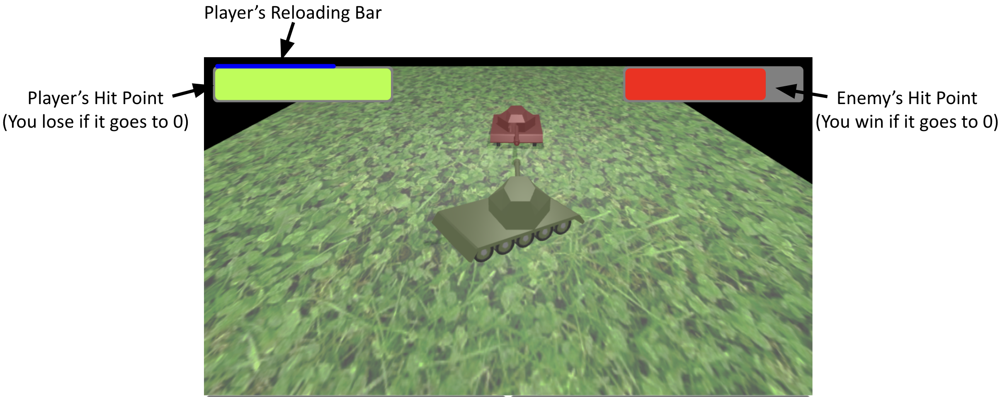

# UCLA CS174A Team Project - Mini Tank Game

 

 

*This project is based on the shadow demo and the collision demo of Tiny Graphics*

Team Members:

- Dyson Huo (huodx@g.ucla.edu)

- Zhizheng Liu (zhizheng@cs.ucla.edu)

## Introduction
In this project, we make a simple version of the online game of *World of Tanks*, i.e., our *Mini Tank Game*. A player would control a turreted tank and fire its gun. There is also an enemy tank controlled by the computer to fight the player’s tank. The player would win the game if the enemy tank is destroyed, while he would lose if the tank’s hit point went to 0. 

## Running the Project

1. Install Python 3
2. One-line HTTP Server: `python3 -m http.server <port>` (use `python` instead of `python3` for some platforms).
3. Visit the local HTTP Server

## Controls
| Key      | Function |
| ----------- | ----------- |
| W      | Move the tank forward       |
| S   | Move the tank backward        |
| A      | Turn the tank to the left       |
| D   | Turn the tank to the right        |
| ,      | Turn the turret to the left and Turn the camera view to the left|
| .   | Turn the turret to the right and Turn the camera view to the right|
| F      | Fire the gun|

## Game UI

## Features
**Tank Model:** 
We use Blender to create a realistic tank model.

**Collision Detection:** We follow the collision detection demo to detection collisions between the player tank and the enemy tank as well the between the shells and the tanks.

**Shadowing:** We follow the shadow demo to add a light source to add shadows and give the scene a more layered look.

**Enemy AI** We use a finite state machine to model the enemy's AI which plays more aggressively with less hit points.
